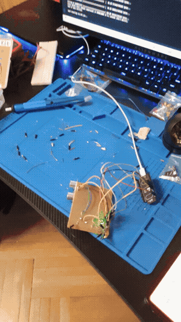
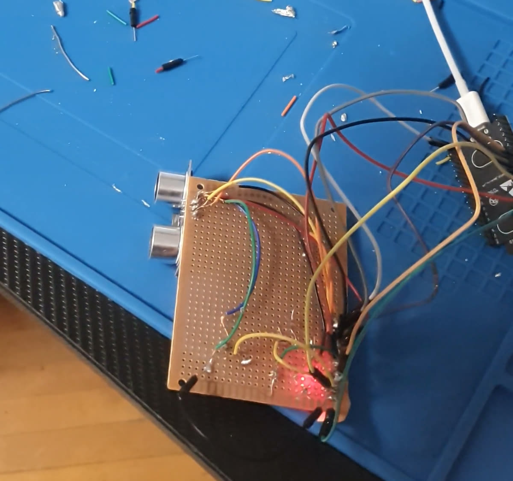
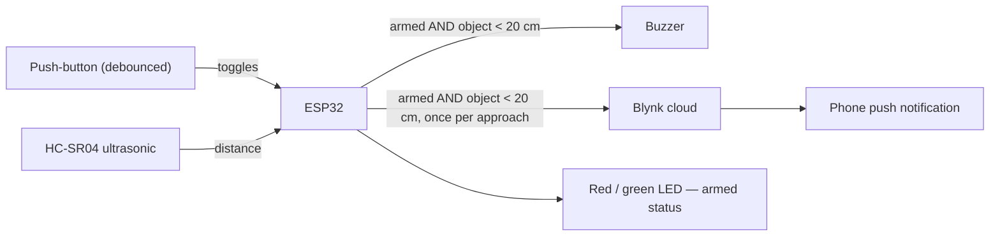

# IoT Proximity Alarm

**Arm it before bed, and the moment someone gets close it buzzes locally *and* puts a push
notification on your phone** — an ESP32, an ultrasonic sensor and a button, talking to the
Blynk cloud. No app to build.

<!-- TODO: demo GIF here — button arms the system (LED green -> red), someone approaches,
     buzzer sounds + phone notification. Drop it in and link it:
      -->



*Hand-soldered on protoboard — no breadboard.*

---

## How it works



One button press toggles **armed / disarmed** (edge-detected, so a press only fires once, not
once per loop). While armed, the ESP32 polls the ultrasonic sensor every ~100 ms; the moment
something is closer than **20 cm**, the buzzer sounds and a single push notification
("Atenție! Cineva este la ușă!") goes out over Blynk. It sends only **once** per approach — a
flag latches until the object moves away again, so standing in front of the sensor doesn't
spam the phone. Disarming (or the object retreating) clears the buzzer and the flag.

## Stack

| Layer | Tech |
|---|---|
| Hardware | ESP32, HC-SR04 ultrasonic sensor, push-button, buzzer, red/green LED |
| Firmware | Arduino / C++ — `WiFi`, `BlynkSimpleEsp32` |
| Cloud / notifications | Blynk (`Blynk.logEvent`) → phone push |
| Build | Hand-soldered on protoboard, no breadboard |

## Running it

```
# 1. Wire it up
#    HC-SR04: trig -> GPIO18, echo -> GPIO19
#    Push-button: GPIO21 (INPUT_PULLUP, other leg to GND)
#    Buzzer: GPIO5 · Red LED: GPIO23 · Green LED: GPIO17

# 2. Secrets
#    copy secrets.h.example -> secrets.h, fill in WiFi SSID/password
#    and your Blynk template ID / template name / auth token
#    (Blynk.Console -> your device -> Device Info)

# 3. Flash
#    open the .ino in Arduino IDE, board "ESP32 Dev Module", Upload
```

Press the button once to arm (LED turns red). Bring an object within 20 cm and the buzzer
sounds; check your phone for the Blynk push. Press again to disarm (LED back to green).

## Behaviour (from testing)

- Detection range: objects under **~20 cm** trigger the alarm.
- Notification latency: **~1 s** from detection to the phone push arriving.
- One notification per approach, not one per reading — the latch avoids spamming Blynk while
  something sits in range.

## Known limitations

- **20 cm is a short range** for a "someone's at the door" alarm — it reacts to something
  right in front of the sensor, not a person walking up from a few steps away. Fine for a
  desk/drawer demo; a real door alarm would want a wider-range PIR or a longer HC-SR04
  reading distance.
- No debounce beyond a single `delay(200)` after a button edge; fine in practice, not a
  general-purpose debounce.
- Credentials (WiFi, Blynk token) live in a gitignored `secrets.h` — see `secrets.h.example`.
